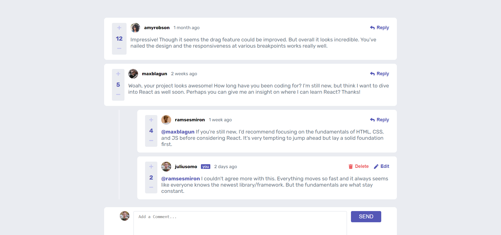
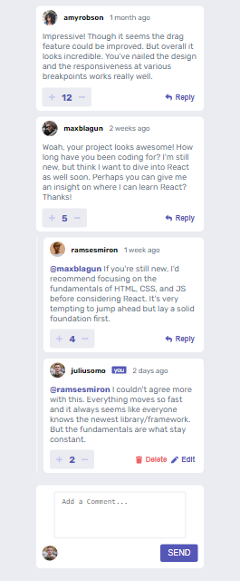

# Interactive comments section

Interactive comments section view with functionality, Task from AbnourGroup.

### Desktop View

### Mobile View

## Technologies used : 
- React
- HTML
- CSS (Pure NO Frameworks)

## Features in Project :
- Adding , Editing and Deleting your Comments or Replies.
- Reply to any comment.
- Comments Sorted by date.
- Upvoting Comments.
- Updating Comment Content (SOON).

### What is Next ?
- Saving comments to Local Storage.
- Sorting Comments based on upvotes.